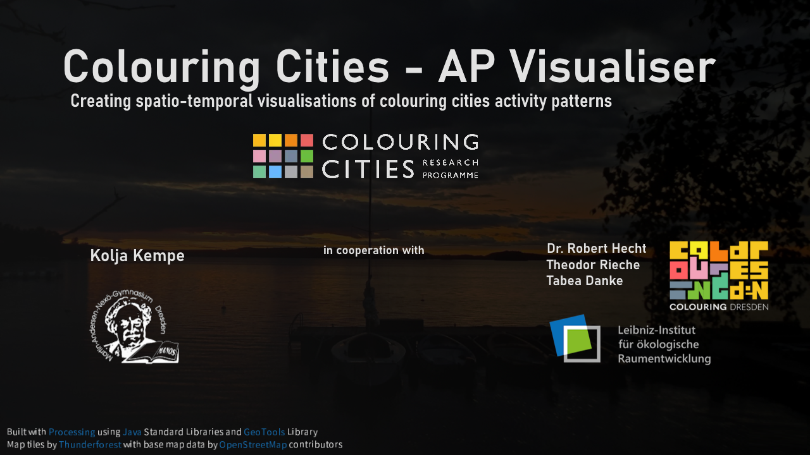

## Disclaimer
This is an experimental beta version of tool only.  
Bugs will occur. 
The author will not take any responsibilities for damage on the system, or any other intricacies caused by the tool.  
For further detail check on the [license](LICENSE).

Currently the tool only works for Colouring Dresden data, however development for further cities is in progress.
  

## Showcase video
Get a quick idea of the program: https://youtu.be/hafOZ8ugh1U
  
## Quick guide
### Setup
1. Download the `Colouring.Cities.AP.Visualiser_win_portable.zip` under the [latest release](https://github.com/P1umPudding/Colouring-Cities-AP-Viusaliser/releases/latest).
2. Extract the zip-File and save its main folder to a location you want to execute the tool from.
3. Start the `ColouringCitiesAPVisualiser_win_portable.exe` within the main folder.

### Data import
- Data for the visualisations can be imported within the import-section of the program. 
- If the section doesn't open automatically or you want to change the imported data click on `Import new data` in the top right corner.
- Either select building (providing a mapping between buildings ids and coordinates) and edit history data combining them together via the start-button to create the data set the tool is then going to continue using, or just open such a ready formatted data set.
  - Both the building data and the edit history can be found in the data download section on the [Colouring Dresden Platform](https://colouring.dresden.ioer.de/). A version of the building data, which doesn't change too frequently, and a version of the edit history data, which however changes regularly, can also be found under [/example-data](./example-data/).
  - The tool specific data set can be created by combining the buildings with the edit history data saving the output local or you may also use the provided sample under [/example-data](./example-data/).

### Visualisation
- Once you have data imported the main section including the visualisation should open up. Otherwise you may click on `Visualise` in the top right corner.

- Within the area of the map displaying the current visualisation buttons allow for zooming (which can also be done using the mouse wheel), recentering the city as well as hiding the legend (which won't be visible at all in the export of the visualisation).
- Below the map, a time slider can be used to control the frame of the animation.
- On the left side different spatio-temporal indicators can be chosen from, defining what aspects should be displayed also allowing for analysis on specific Colouring Cities properties or categories via one of the indicators. 
- Below, you can select one of three time intervals. The cumulative setting adds up all data from the start of the data collection while turning it off will only display activities within the current time interval (day/week/month).
- You may choose from one of the spatial divisions (a 100m-grid, a 1000m-grid and city districts) as the visualisations are based on choropleth maps.
- On the right side of the map a menu allows to adjust visibility, transparency and colour of map layers to tweak the looks of the visualisation. 

### Export
-  Once all settings are the way you want them to be, you can open an export popup by pressing `Export` in the top right corner. 
- You can choose to just export the currently displayed time frame or all frames from a start to an end date which you can choose freely within the range of imported data.
- Exporting as .png will give you images similar to what you were able to see within the tool, exporting as .geotiff (for a spatial raster selection) or .geogjson (for city districts) will create georeferenced data to enable further analysis.
- Pressing the `Export`-Button within the popup, you can select a location, after which the export will start automatically. Exporting a time series may take some time. The single frames will automatically be named `chosen-name_date-of-frame`.
- Unfortunately, at the moment you have to combine exported images to an animation by yourself. Exporting animated GIF or videos may follow in a later version.

  

&nbsp;&nbsp;&nbsp;&nbsp;&nbsp; 

